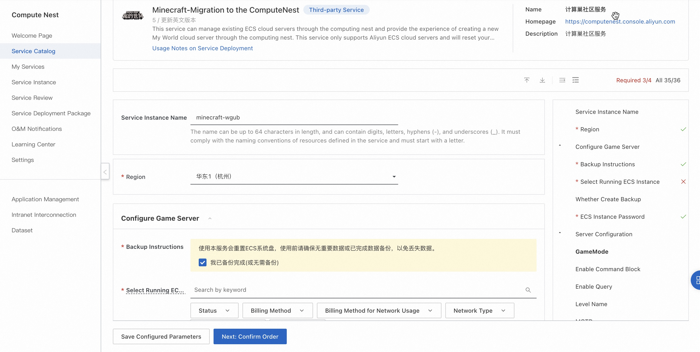
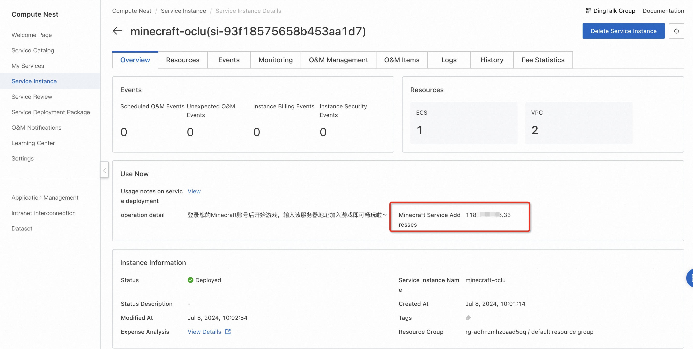
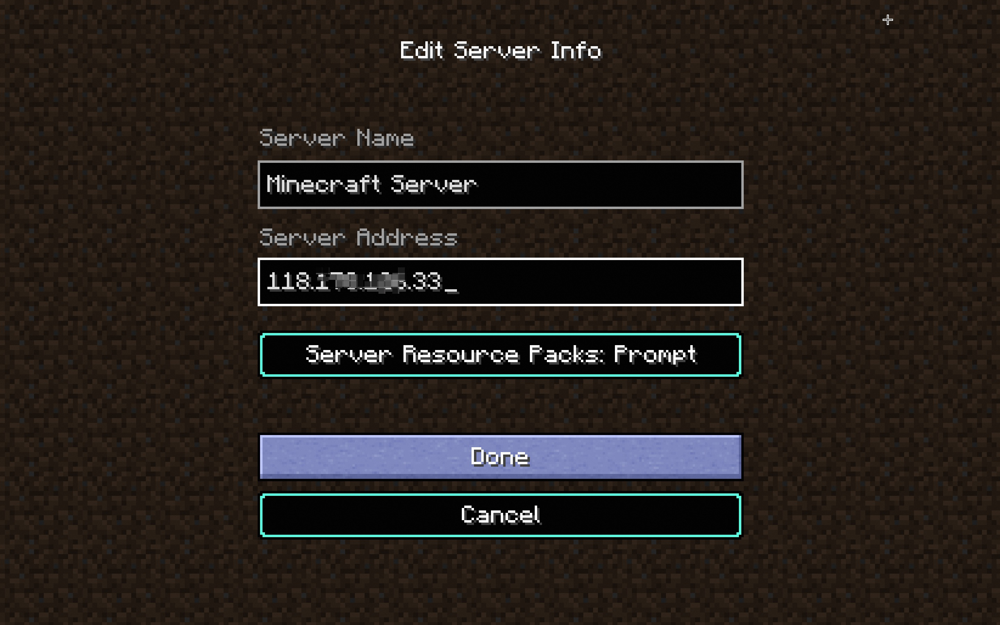

<h1>5 minutes, migrate my world server to compute nest </h1>

 The migration process is simple:
<ol start="1">
<li>
Create a computing nest My World Migration Service instance.

</li>
<li>
 After the service instance is created, obtain the service address on the details page

</li>
<li>
 login game account, select multiplayer mode, add and join the server

</li>
<li>
 Start the game!

</li>
</ol>
